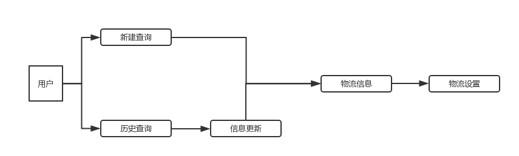
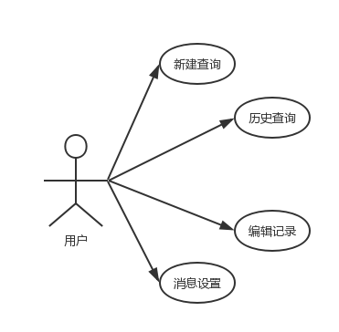
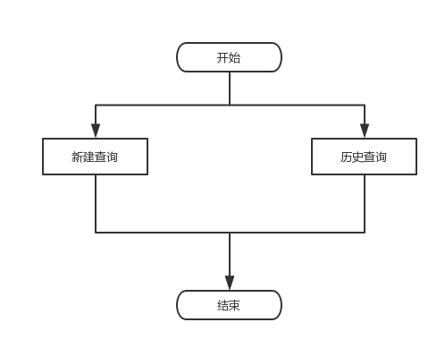
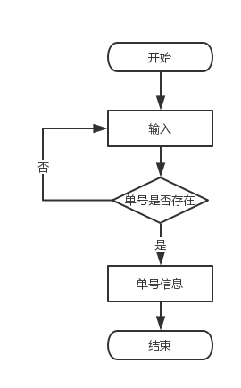
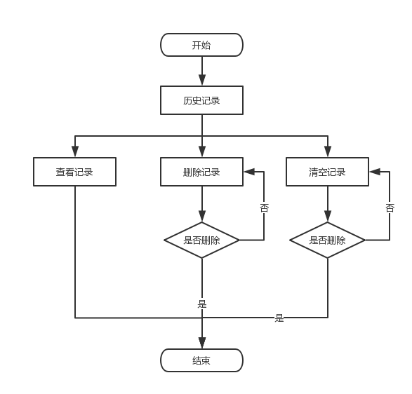
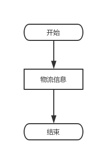

# 需求分析 #
> ## 项目背景  ##
>> 寄件人/收件人对于已发快递无法快速了解快递已达地点，不能够把握快递快递达到的大致时间，无法高效及时地收取快递。
> ## 项目描述 ##
>> 本产品“快查”可以进行关于物流查询的一系列操作。包括用户查询运单号、查询和编辑历史运单号、查看物流详细信息以及对快递实时更新的消息提示设置。  
> 快查可运行于android手机。
> ## 运行环境 ##
>> 硬件环境：Android手机  
> 软件环境：Android6.0以上系统  
> ## 系统流程图 ##
>
> ## 功能需求 ##
>> 新建查询：支持手动输入运单号查询  
> 历史查询：对已经查询过的运单号进行保存，便于二次查询，同时拥有删除已有记录  
> 信息更新：对历史物流信息进行实时更新  
> 物流信息：给出查询快递信息，包括：运单号、快递公司、派件人、派件人联系方式、物流地点变换  
> 物流设置：对快递设置实时关注，物流地点变换会对给用户发出消息提示（功能尚未完善）
# 概要设计 #
> ## 用例图 ##
> 
>
> ## 页面功能 ##  
>>
>><table>
>><tr>
>><th>页面</th>
>><th>输入数据</th>
>><th>输出数据</th>
>></tr>
>><tr>
>><th rowspan="2">查询选择页面</th>
>><th>新建查询</th>
>><th>进入新建查询页面</th>
>></tr>
>><tr>
>><th>历史查询</th>
>><th>进入历史查询页面</th>
>></tr>
>><tr>
>><th>新建查询页面</th>
>><th>输入运单号</th>
>><th>进入物流信息页面</th>
>></tr>
>><tr>
>><th rowspan="3">历史查询页面</th>
>><th>选择历史运单号</th>
>><th>进入物流信息页面</th>
>></tr>
>><tr>
>><th>编辑历史运单号</th>
>><th>删除该项历史记录</th>
>></tr>
>><tr>
>><th>清空记录</th>
>><th>删除所有历史记录</th>
>></tr>
>><tr>
>><th>物流信息页面</th>
>><th>实时通知</th>
>><th>实时提示物流地点变换</th>
>></tr>
>></table>
>>
>> ## 查询选择页面 ##
>> 
>>
>>- 功能描述：用户选择新建查询或者历史查询
>>- 操作规程描述：用户点击新建查询或者历史查询
>>- 处理过程描述：用户点击新建查询进入新建查询页面；用户点击历史查询进入历史查询页面
>>
>> ## 新建查询流程图 ##
>> 
>>
>>- 功能描述：用户新建单号查询
>>- 操作规程描述：用户输入单号
>>- 处理过程描述：用户输入不存在的单号或者单号为空，页面给出单号不存在的提示；用户输入正确的单号，进入物流信息页面；用户点击返回，返回查询选择页面
>>
>> ## 历史查询流程图 ##
>> 
>>
>>- 功能描述：用户查看历史记录，对历史记录进行查看和删除
>>- 操作规程描述：用户点击历史记录进入物流信息页面；用户长按历史记录，选择进入物流信息页面或者删除该记录；用户点击清空记录删除所有历史记录
>>- 处理过程描述：用户选择删除或者清空历史记录时，页面给出是否确认删除提示
>>
>> ## 物流信息页面 ##
>> 
>>
>>- 功能描述：用户查看物流信息
>>- 操作规程描述：用户设置实时通知（尚未完善）
>>- 处理过程描述：用户设置实时通知，物流更新后后台发出消息提醒
>
> ## 数据库 ##
>> 
>> 表：SearchingHistory  
>><table>
>><tr>
>><th>字段名</th>
>><th>字段类型</th>
>><th>备注</th>
>></tr>
>><tr>
>><th>Number</th>
>><th>TEXT</th>
>><th>运单号</th>
>></tr>
>><tr>
>><th>CompanyCode</th>
>><th>TEXT</th>
>><th>运单号所属快递公司</th>
>></tr>
>><tr>
>><th>Date</th>
>><th>TEXT</th>
>><th>历史查询时间</th>
>></table>
>
> ## 硬件接口 ##
>>
>>- 安卓手机：android 6.0 以上；API 21以上
>>- 移动数据
> 
> ## 软件接口 ##
>>
>>- 安卓操作系统    
>>- 快递鸟单号识别API  
>>- SQLite数据库
